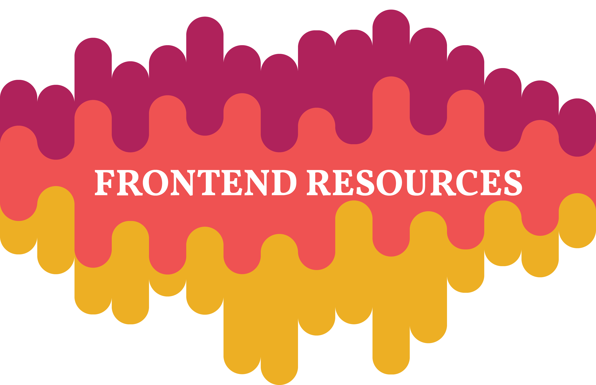

## Table of contents :bookmark:

* [Free Stuff](#free-stuff-moneybag)
* [General resources](#general-resources-floppy-disk)
* [Sites](#sites-computer)
* [Twitter](#twitter-bird)
* [Tutorial sites and courses](#tutorial-sites-and-courses-open_book)
* [Subreddits](#subreddits-information_source)
* [Books](#books-books)
* [Best Practice](#best-practice-eyeglasses)
* [Project Ideas](#project-ideas-bulb)
* [Tools and libraries](#tools-and-libraries)
* [APIs](#apis-satellite)

## Free Stuff :moneybag:

* [free-for-dev @ GitHub](https://github.com/ripienaar/free-for-dev)
    - A collection of free/discount stuff for all developers
* [discount-for-student-dev @ GitHub](https://github.com/AchoArnold/discount-for-student-dev)
    - A collection of free/discount stuff for student developers
* [GitHub Developer Pack](https://education.github.com/pack)
    - A lot of free stuff for students, for example free **private** repos. ([GitLab](https://about.gitlab.com/) has private repos for free for everyone)
* [free-programming-books @ GitHub](https://github.com/vhf/free-programming-books/blob/master/free-programming-books.md)
    - A collection of all free programming books, ALL! (Not only JavaScript and frontend)

**[⬆ back to top](#table-of-contents-bookmark)**

## General resources :floppy_disk:

* [__AWESOME__ by _sindresorhus@github_](https://github.com/sindresorhus/awesome)
    - _A curated list of awesome lists_, great collection of all kinds of resources in all kinds of fields.
* [__Web Developer Roadmap__ by _kamranahmedse@github_](https://github.com/kamranahmedse/developer-roadmap)
    - A diagram of which paths to take when trying to become a frontend/backend/fullstack developer
* [__Practical Color Theory For People Who Code__ by __tallys@github_](https://tallys.github.io/color-theory/)
    - An interactive guide to picking a color scheme.

**[⬆ back to top](#table-of-contents-bookmark)**

## Sites :computer:

* [Dev.to](https://dev.to/)
    - Mixed development blog, powered by the community.
* [Smashing Magazine](https://www.smashingmagazine.com/)
    - Frontend blog
    - Subscribe to their newsletter [Web Development Reading List](https://www.smashingmagazine.com/tag/web-development-reading-list/)
* [A List Apart](https://alistapart.com/)
    - Frontend blog, much focus on _Progressive Enhancement_
* [CSS Wizardy](https://csswizardry.com/)
    - Frontend blog by Harry Roberts, CSS Expert
* [Codrops](https://tympanus.net/codrops/)
    - A lot of cool resources on experimental CSS/HTML.
    - Subscribe their newsletter [Codrops Collective](https://tympanus.net/codrops/collective/)
* [David Walsh](https://davidwalsh.name/)
    -  JavaScript blog (also Kyle Simpson co-writes on this blog)
* [Sara Soueidan](https://sarasoueidan.com/)
    - Frontend blog, focus on _Progressive Enhancement_ and _SVG_
* [Eric Elliot @ Medium](https://medium.com/@_ericelliott)
    - JavaScript Blog with focus on the more deeper stuff about Inhertiance, prototypes and those things.

**[⬆ back to top](#table-of-contents-bookmark)**

## Twitter :bird:

* [Jesper Orb](https://twitter.com/jesperorb)
    - JavaScript noob, just retweets dumb stuff
* [The Practical Dev](https://twitter.com/ThePracticalDev)
    - Mixed development stuff
* [Ethan Marcotte](https://twitter.com/beep)
    - Frontend developer, coined the term _Responsive Web Design_
* [Dan Abramov](https://twitter.com/dan_abramov)
    - Creator of redux, general JS guy
* [Eric Elliot](https://twitter.com/_ericelliott)
    - JavaScript developer
* [Sara Souidan](https://twitter.com/SaraSoueidan)
    - HTML, CSS and SVG enthusiast
* [Addy Osmani](https://twitter.com/addyosmani)
    - Creator of [JavaScript Design Patterns](https://addyosmani.com/resources/essentialjsdesignpatterns/book/)
* [David Walsh](https://twitter.com/davidwalshblog)
    - JavaScript blogger
* [Kent C Dodds](https://twitter.com/kentcdodds)
    - JavaScript Developer and egghead tutorial guy
* [John Lindquist](https://twitter.com/johnlindquist)
    - JavaScript Developer and egghead tutorial guy
* [JS Daily](https://twitter.com/JavaScriptDaily)
    - General JavaScript resources
* [FrontEnd Daily](https://twitter.com/FrontEndDaily)
    - General Frontend Resources
* [Sindre Sorhus](https://twitter.com/sindresorhus)
    - JavaScript Developer

**[⬆ back to top](#table-of-contents-bookmark)**

## Tutorial sites and courses :open_book:

* [Wes Bos](http://wesbos.com/)
    - Free and paid courses on specific JavaScript topics. Do the [#JavaScript30](https://javascript30.com/) course, it's free.
* [egghead.io](https://egghead.io/)
    - Short videos about very specific topics on JavaScript. Many free videos and some are _PRO_ that you have to pay for. No trial period.
* [Pluralsight](https://www.pluralsight.com/)
    - If you sign up for free @ [Visual Studio Dev Essentials](https://www.visualstudio.com/dev-essentials/) you get **3 months of free subscription to Pluralsight**
* [Treehouse](https://teamtreehouse.com/)
    - Tutorials on many subjects, 7-day free trial

**[⬆ back to top](#table-of-contents-bookmark)**

## Subreddits :information_source:

* [reddit.com/r/webdev](https://www.reddit.com/r/webdev/)
    - General frontend development
* [reddit.com/r/web_design](https://www.reddit.com/r/web_design/)   
    - Focus on html/css and design
* [reddit.com/r/javascript](https://www.reddit.com/r/javascript/)
    - Only JavaScript
* [reddit.com/r/frontend](https://www.reddit.com/r/Frontend/)
    - General frontend

**[⬆ back to top](#table-of-contents-bookmark)**

## Books :books:

* [__You Don't Know JavaScript__ by _Kyle Simpson_](https://github.com/getify/You-Dont-Know-JS)
* [__Eloquent JavaScript by__ by _Marijn Haverbeke_](http://eloquentjavascript.net/)
* [__JavaScript: The Good Parts__ by _Douglas Crockford_](http://shop.oreilly.com/product/9780596517748.do)
* [__JavaScript Design Patterns__ by _Addy Osmani_](https://addyosmani.com/resources/essentialjsdesignpatterns/book/)

**[⬆ back to top](#table-of-contents-bookmark)**

## Best practice :eyeglasses:

#### JavaScript 

* [__Clean Code JavaScript__ by _ryanmcdermott@github_](https://github.com/ryanmcdermott/clean-code-javascript)
    - "Software engineering principles" from the book [Clean Code](https://www.amazon.com/Clean-Code-Handbook-Software-Craftsmanship/dp/0132350882) adapted to JavaScript (the book is originally written with examples in Java).
* [__Code Conventions for the JavaScript Programming Language__ by _Douglas Crockford_](http://javascript.crockford.com/code.html)
    - Douglas Crockford own standard for writing JavaScript
* [jstherightway.org](http://jstherightway.org/)
    -  Not necessarily the right way but a collection of what is considered to be best practices by many.
* [__JavaScriptBest Practices__  by _stevekwan@github_](https://github.com/stevekwan/best-practices/blob/master/javascript/best-practices.md)
    - A collection of stuff to think about when writing JavaScript
* [__10 interview Questions Every JavaScript Developer Should Know__ by _Eric Elliot_](https://medium.com/javascript-scene/10-interview-questions-every-javascript-developer-should-know-6fa6bdf5ad95#.qcy8ey1ky)
    - Very opinionated (and a lot of hating at certain inheritance in JS) but a good primer.

#### CSS

* [CSSWizardry - Code Smells in CSS (2012)](https://csswizardry.com/2012/11/code-smells-in-css/)
* [CSSWizardry - Code Smells in CSS Revisited (2017)](https://csswizardry.com/2017/02/code-smells-in-css-revisited/)
* [SitePoint - Golden Rules for Writing Clean CSS (2017)](https://www.sitepoint.com/golden-guidelines-for-writing-clean-css/)

**[⬆ back to top](#table-of-contents-bookmark)**

## Project ideas :bulb:

* [Martyr2's Mega Project Ideas List](http://www.dreamincode.net/forums/topic/78802-martyr2s-mega-project-ideas-list/)
    - A list of project you can do, not specific to JavaScript but general programming.
    - [A collection of projects created from this list](https://github.com/karan/Projects-Solutions/blob/master/README.md)
* [The Internet Wishlist @ Twitter](https://twitter.com/theiwl) 
    - "Hey someone should create this"
* [Ideamachine.io](http://www.ideamachine.io/)
    - "Hey someone should create this"

**[⬆ back to top](#table-of-contents-bookmark)**

## Tools and libraries :hammer:

* [Vanilla List](http://www.vanillalist.com/)
    - Collection of vanilla JavaScript libraries
* [You Might Not Need jQuery](http://youmightnotneedjquery.com/)
    - Comparison of jQuery functions and their vanilla counterpart
* [You Don't Need JavaScript](https://github.com/you-dont-need/You-Dont-Need-Javascript)
    - JS stuff you can do with HTMl/CSS

**[⬆ back to top](#table-of-contents-bookmark)**

## APIs :satellite:

* [**Public APIs** by _toddmotto_ @ GitHub](https://github.com/toddmotto/public-apis)
    - Collection of APIs
* [**Public APIs** by _abhishekbanthia_ @ GitHub](https://github.com/abhishekbanthia/Public-APIs)
    - Collection of public APIs
* [Programmable Web API Directory](https://www.programmableweb.com/category/all/apis)
    - Collection of public APIs
* [API-katalogen](http://apikatalogen.se/)
    - Collection of swedish APIs

**[⬆ back to top](#table-of-contents-bookmark)**

